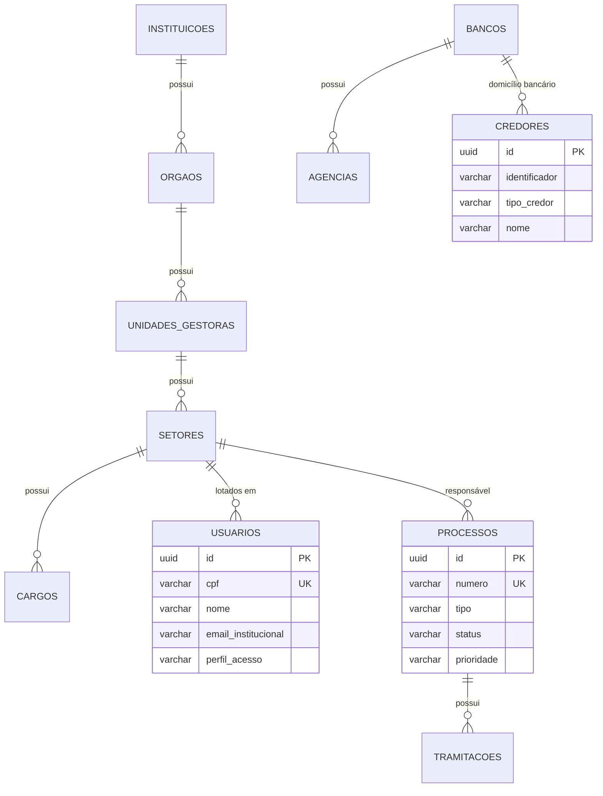
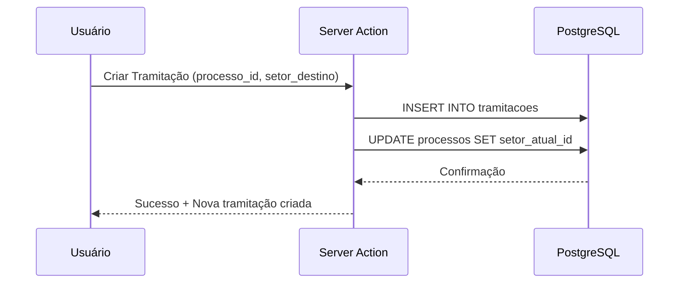
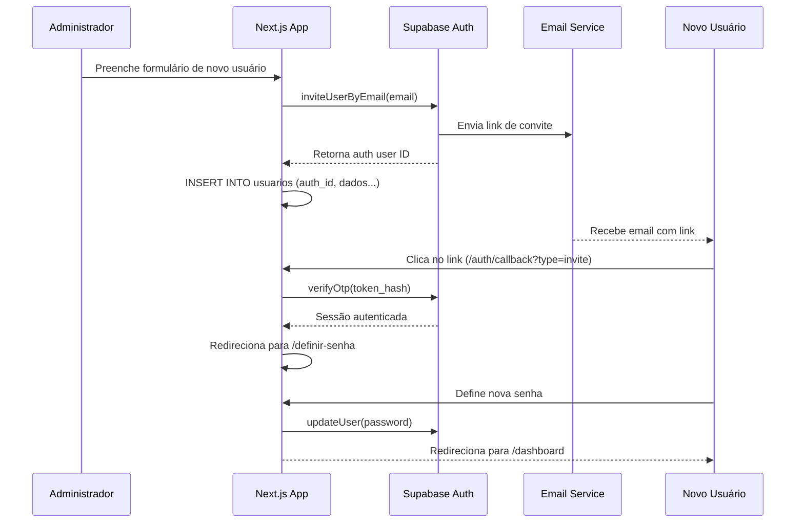
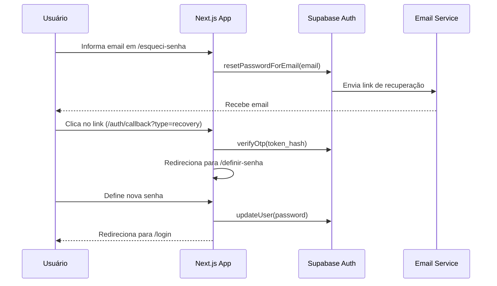

# Documentação Técnica: SIAGOV
**Sistema Integrado de Apoio ao Governo**  
*Versão: 0.1.0 | Última Atualização: 2026-02-06*

---

## 1. Contexto Estratégico

### 1.1 Objetivo do Sistema
O SIAGOV centraliza e digitaliza a gestão administrativa de órgãos públicos, abrangendo:
- Controle de hierarquia organizacional (Instituições, Órgãos, Unidades Gestoras, Setores)
- Gestão de processos administrativos e tramitações
- Cadastro de credores (Pessoas Físicas e Jurídicas)
- Controle de usuários com autenticação baseada em CPF
- Gestão de exercícios financeiros

### 1.2 Domínio
Gestão Pública / Administração Estadual e Municipal.

### 1.3 Principais Stakeholders
| Stakeholder | Função |
|-------------|--------|
| Administrador do Sistema | Gestão de usuários, configurações globais |
| Gestor de Órgão | Supervisão de processos e aprovações |
| Operador | Cadastros, tramitações, operações diárias |
| Consulta | Acesso somente leitura |

### 1.4 Entidades Principais
```
Instituição → Órgão → Unidade Gestora → Setor → Cargo → Usuário
                                              ↓
                                          Processo → Tramitação
                                              ↓
Banco → Agência → Credor
```

---

## 2. Arquitetura do Sistema

### 2.1 Stack Tecnológica

| Componente | Tecnologia | Versão |
|------------|------------|--------|
| Runtime | Node.js | 20.x |
| Framework | Next.js (App Router) | 16.1.6 |
| UI Library | React | 19.2.3 |
| Linguagem | TypeScript | 5.x |
| Banco de Dados | PostgreSQL (Supabase) | 15+ |
| Autenticação | Supabase Auth | 2.78.0 |
| Estado Global | Zustand | 5.0.10 |
| Validação | Zod | 4.3.6 |
| Formulários | React Hook Form | 7.71.1 |
| UI Components | Radix UI + shadcn/ui | Latest |
| Rich Text | TipTap | 3.18.0 |
| Estilização | Tailwind CSS | 4.x |

### 2.2 Arquitetura de Pastas

```
siagov-next/
├── src/
│   ├── app/                    # Next.js App Router
│   │   ├── (auth)/             # Route Group: páginas de autenticação
│   │   │   ├── login/
│   │   │   ├── esqueci-senha/
│   │   │   ├── definir-senha/
│   │   │   └── redefinir-senha/
│   │   ├── (dashboard)/        # Route Group: área autenticada
│   │   │   ├── cadastros/      # CRUD de entidades
│   │   │   ├── processos/      # Gestão de processos
│   │   │   ├── chamados/       # Sistema de chamados
│   │   │   ├── documentos/     # Gestão documental
│   │   │   ├── relatorios/     # Relatórios
│   │   │   └── configuracoes/  # Configurações
│   │   └── auth/               # Server Actions de autenticação
│   ├── components/             # Componentes React reutilizáveis
│   │   └── ui/                 # shadcn/ui components
│   ├── hooks/                  # Custom React Hooks
│   ├── lib/                    # Utilitários e configurações
│   │   └── supabase/           # Clients Supabase (server/client)
│   ├── services/               # Camada de serviços
│   │   └── api/                # Services para cada entidade
│   ├── types/                  # TypeScript interfaces
│   └── utils/                  # Funções utilitárias
├── supabase/
│   ├── schema.sql              # Definição completa do schema
│   └── migrations/             # Arquivos de migração
└── public/                     # Assets estáticos
```

### 2.3 Padrões de Projeto

| Padrão | Aplicação |
|--------|-----------|
| **App Router** | Roteamento baseado em file-system com Route Groups |
| **Server Actions** | Mutações de dados via `'use server'` |
| **Service Layer** | Abstração de acesso a dados por entidade |
| **Zustand Stores** | Estado global para auth e tema |
| **Row Level Security** | Políticas de acesso no Supabase |

### 2.4 Autenticação

**Fluxo de Login:**
1. Usuário submete CPF + Senha
2. Server Action `loginWithCpf` busca email na tabela `usuarios` pelo CPF
3. Supabase Auth valida credenciais
4. Sessão é criada via cookies SSR

**Fluxo de Convite:**
1. Admin cria usuário via `createUserWithInvite`
2. Supabase envia email com magic link
3. Callback (`/auth/callback`) processa token
4. Se `type=invite`, redireciona para `/definir-senha`
5. Usuário define senha via `updatePassword`

---

## 3. Esquema de Dados

### 3.1 Diagrama ER (Simplificado)



### 3.2 Entidades Principais

#### Hierarquia Organizacional

| Tabela | Chave | Relacionamento |
|--------|-------|----------------|
| `instituicoes` | `id` | Raiz da hierarquia |
| `orgaos` | `id` | `instituicao_id → instituicoes` |
| `unidades_gestoras` | `id` | `orgao_id → orgaos` |
| `setores` | `id` | `unidade_gestora_id → unidades_gestoras` |
| `cargos` | `id` | `setor_id → setores` |
| `usuarios` | `id` | `setor_id → setores`, `cargo_id → cargos` |

#### Processos e Tramitações

| Tabela | Descrição |
|--------|-----------|
| `processos` | Processos administrativos com status e prioridade |
| `tramitacoes` | Histórico de movimentação entre setores |

#### Financeiro

| Tabela | Descrição |
|--------|-----------|
| `bancos` | Instituições financeiras |
| `agencias` | Agências bancárias |
| `credores` | Fornecedores (PF/PJ) com dados bancários |
| `exercicios_financeiros` | Anos fiscais por instituição |

### 3.3 Fluxo de Tramitação



---

## 4. Regras de Negócio

> [!IMPORTANT]
> Esta seção documenta restrições críticas do sistema.

### 4.1 Autenticação e Acesso

| ID | Regra | Trigger | Restrição |
|----|-------|---------|-----------|
| **RN-AUTH-01** | Login por CPF | `loginWithCpf` | CPF deve existir em `usuarios` com email válido |
| **RN-AUTH-02** | Perfis de Acesso | Toda requisição autenticada | Valores permitidos: `Administrador`, `Gestor`, `Operador`, `Consulta` |
| **RN-AUTH-03** | Convite de Usuário | `createUserWithInvite` | Email deve ser único no Supabase Auth |

### 4.2 Hierarquia Organizacional

| ID | Regra | Trigger | Restrição |
|----|-------|---------|-----------|
| **RN-ORG-01** | Código Único | Criação de qualquer entidade | Código deve ser único dentro do escopo pai |
| **RN-ORG-02** | Cascata de Exclusão | `DELETE` em entidade pai | Todas as entidades filhas são removidas |
| **RN-ORG-03** | Esfera de Instituição | Criação de Instituição | Valores: `Federal`, `Estadual`, `Municipal`, `Distrital` |
| **RN-ORG-04** | Poder Vinculado | Criação de Órgão | Obrigatório. Valores: `Executivo`, `Legislativo`, `Judiciário` |

### 4.3 Processos

| ID | Regra | Trigger | Restrição |
|----|-------|---------|-----------|
| **RN-PROC-01** | Número Único | Criação de Processo | Formato: `AAAA.NNNNN` (ano + sequencial) |
| **RN-PROC-02** | Status Válidos | Alteração de Status | `Aberto`, `Em Andamento`, `Em Tramitação`, `Aguardando`, `Concluído`, `Arquivado`, `Cancelado` |
| **RN-PROC-03** | Prioridades | Criação/Edição | `Baixa`, `Normal`, `Alta`, `Urgente` |
| **RN-PROC-04** | Processo Cancelado | Tentativa de tramitação | Se `status = Cancelado`, bloquear nova tramitação |

### 4.4 Credores

| ID | Regra | Trigger | Restrição |
|----|-------|---------|-----------|
| **RN-CRED-01** | Tipo de Credor | Criação | Define máscara: `Física` = CPF (14 chars), `Jurídica` = CNPJ (18 chars) |
| **RN-CRED-02** | Conta Bancária | Domicílio Bancário | Tipos: `Corrente`, `Poupança`, `Salário` |
| **RN-CRED-03** | Optante Simples | Edição | Se `optante_simples = true`, exibir `data_final_opcao_simples` |

---

## 5. Serviços (API Layer)

### 5.1 Estrutura Base

Todos os serviços herdam de `baseService.ts` e seguem o padrão:

```typescript
// Padrão de método de serviço
async function listar(): Promise<Entity[]> {
    const supabase = createBrowserClient();
    const { data, error } = await supabase
        .from('tabela')
        .select('*')
        .order('created_at', { ascending: false });
    
    if (error) throw error;
    return data;
}
```

### 5.2 Serviços Disponíveis

| Serviço | Entidade | Métodos Principais |
|---------|----------|-------------------|
| `instituicoesService` | Instituições | `listar`, `buscarPorId`, `criar`, `atualizar`, `excluir` |
| `orgaosService` | Órgãos | `listar`, `listarPorInstituicao`, `criar`, `atualizar` |
| `unidadesService` | Unidades Gestoras | `listar`, `listarPorOrgao`, `criar`, `atualizar` |
| `setoresService` | Setores | `listar`, `listarPorUnidadeGestora`, `criar`, `atualizar` |
| `cargosService` | Cargos | `listar`, `listarPorSetor`, `criar`, `atualizar` |
| `usuariosService` | Usuários | `listar`, `buscarPorCpf`, `criar`, `atualizar` |
| `bancosService` | Bancos | `listar`, `criar`, `atualizar` |
| `agenciasService` | Agências | `listar`, `listarPorBanco`, `criar`, `atualizar` |
| `credoresService` | Credores | `listar`, `buscarPorIdentificador`, `criar`, `atualizar` |
| `processosService` | Processos | `listar`, `buscarPorNumero`, `criar`, `atualizar` |
| `exerciciosService` | Exercícios Financeiros | `listar`, `buscarAtivo`, `criar` |
| `chamadosService` | Chamados | `listar`, `criar`, `atualizar` |
| `documentosService` | Documentos | `listar`, `criar`, `atualizar` |

---

## 6. Guia para Agentes de IA

### 6.1 Convenções de Código

| Aspecto | Convenção |
|---------|-----------|
| **Nomenclatura de Arquivos** | `kebab-case.ts` ou `kebab-case.tsx` |
| **Nomenclatura de Variáveis** | `camelCase` |
| **Interfaces** | Prefixo `I` (ex: `IUsuario`, `IProcesso`) |
| **Tipos DB** | Sufixo `DB` para mapeamento direto (ex: `IUsuarioDB`) |
| **Server Actions** | Arquivo `actions.ts` na pasta da rota |
| **Services** | Arquivo `[entidade]Service.ts` em `src/services/api` |

### 6.2 Padrão de Commits

```
<tipo>(<escopo>): <descrição>

Tipos: feat, fix, docs, style, refactor, test, chore
Escopo: auth, cadastros, processos, ui, db
```

### 6.3 Tratamento de Erros

```typescript
// Padrão para Server Actions
export async function minhaAction(data: FormData) {
    try {
        // lógica
        return { success: true, data: resultado };
    } catch (error) {
        console.error('Nome da Action Error:', error);
        return { error: 'Mensagem amigável ao usuário.' };
    }
}
```

### 6.4 Máscaras de Entrada

| Campo | Função | Formato |
|-------|--------|---------|
| CPF | `maskCpf()` | `000.000.000-00` |
| CNPJ | `maskCnpj()` | `00.000.000/0000-00` |
| CEP | `maskCep()` | `00000-000` |
| Telefone | `maskTelefone()` | `(00) 00000-0000` |

### 6.5 Checklist de Manutenção

- [ ] Verificar tipos em `src/types/entities.ts` antes de criar interfaces
- [ ] Usar serviços existentes em `src/services/api` para operações CRUD
- [ ] Aplicar máscaras de `src/utils/masks.ts` para campos formatados
- [ ] Manter consistência visual usando componentes de `src/components/ui`
- [ ] Atualizar schema SQL em `supabase/schema.sql` para mudanças de banco
- [ ] Criar migrações em `supabase/migrations/` para alterações incrementais

### 6.6 Variáveis de Ambiente

```env
# Supabase
NEXT_PUBLIC_SUPABASE_URL=https://xxx.supabase.co
NEXT_PUBLIC_SUPABASE_ANON_KEY=xxx
SUPABASE_SERVICE_ROLE_KEY=xxx

# App
NEXT_PUBLIC_APP_URL=http://localhost:3000
```

---

## 7. Fluxos Críticos

### 7.1 Criação de Usuário com Convite



### 7.2 Recuperação de Senha



---

## 8. Glossário

| Termo | Definição |
|-------|-----------|
| **Instituição** | Entidade governamental de nível superior (Estado, Prefeitura) |
| **Órgão** | Subdivisão da instituição vinculada a um poder |
| **Unidade Gestora (UG)** | Unidade administrativa com autonomia de gestão |
| **Setor** | Departamento dentro de uma UG |
| **Credor** | Fornecedor (PF ou PJ) para pagamentos |
| **Tramitação** | Movimentação de processo entre setores |
| **Exercício Financeiro** | Ano fiscal vigente para operações |

---

*Documentação gerada para consumo por agentes de IA em 2026-02-06.*
